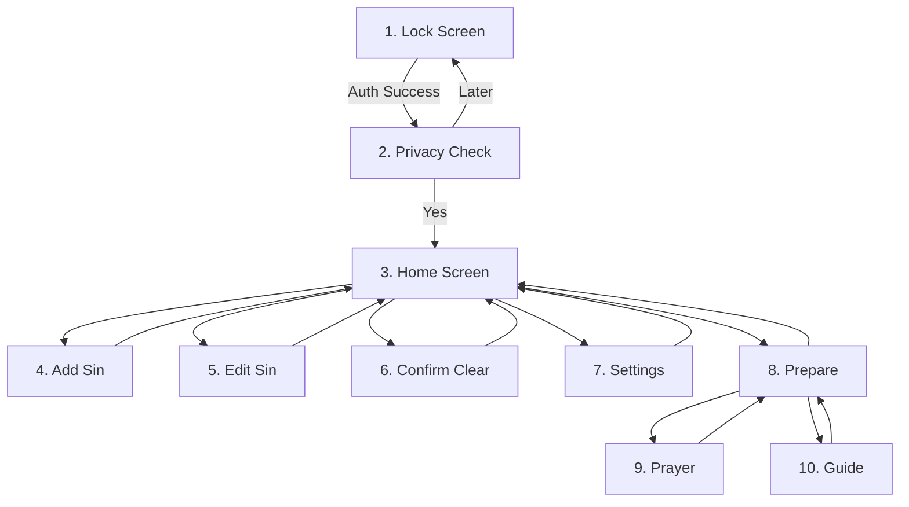

# Screens Specification

Kneel has **10 screens** organized into core flows and auxiliary sections.

---

## Screen Flow



---

## 1. Lock / Auth Screen

**Purpose**: Secure app access with device authentication.

---

## 2. Privacy Check Screen

**Purpose**: Gentle pause before reflection (session-only).

---

## 3. Home Screen (One-Handed Navigation)

**Purpose**: Main screen showing confession state and entry list.

### Layout
```
┌────────────────────────────────┐
│ Jan 16, 2026 ✏️ (4 days ago)    │
├────────────────────────────────┤
│                                │
│  • Entry 1 (Rose)              │
│  • Entry 2 (Sage)              │
│  • Entry 3                     │
│  ...                           │
│                                │
├────────────────────────────────┤
│        [+ Add Entry]           │
│ [Confessed?]     [📖 Prepare]  │
│ [⚙️ Settings]    [           ]  │
└────────────────────────────────┘
```

### Elements
| Element | Description |
|---------|-------------|
| Last Confession Date | Inline date with pencil icon. Tap to edit directly. |
| Parenthetical Timer | e.g. "(4 days ago)". Inline reminder since last confession. |
| Entry List | Multi-line text entries. Sorted newest first. |
| Footer Grid | 2x2 grid containing Core actions: **Add Entry**, **Confessed?**, **Prepare**, & **Settings**. |

### Interactions
- **Swipe left** on entry → Edit
- **Swipe right** on entry → Delete (with undo toast)
- **Tap** entry → Expand/collapse text
- **Long press** entry → Color picker (when enabled)

---

## 4. Add / 5. Edit Entry

**Purpose**: Input or modify free-text reflections.

### Layout
- **Reachability**: Fixed footer containing **Back** (Left) and **Save** (Right).
- **Back Button**: Standardized 120px wide touch target.

---

## 6. Confirm Clear ("Confessed?")

**Purpose**: Specialized ritualistic confirmation before clearing data.

### Elements
- **Icon**: Primary accent checkmark (WhatsApp Green in Dark mode).
- **Heading**: "Ready for a fresh start?"
- **Warning**: "**This will permanently delete all entries from your device.**" (Bolded for emphasis).
- **Date Picker**: Field to set the historical date of confession (defaults to Today).
- **Actions**: "Cancel" and "Confirm" buttons in the footer.

---

## 7. Settings Screen

**Purpose**: Configure app preferences with one-handed reachability.

### Elements
- **Layout**: Uses a flexible spacer to push toggle items toward the lower half of the screen.
- **Back Button**: Standardized 120px wide button, centered at the bottom.

---

## 8. Prepare Screen

**Purpose**: Resource hub for reflection.

### Elements
- **Grid Hub**: ❓ Help Card, 🙏 Prayer Before, ❤️ Act of Contrition, 📖 Guide.
- **Footer**: Centered 120px wide "Back" button.

---

## 9. Prayer Screen

**Purpose**: Read-only text display.

### Elements
- **Layout**: Full-height scrollable text.
- **Footer**: Centered 120px wide "Back" button.

---

## 10. Guide Screen

**Purpose**: 25-page swipeable examination of conscience.

### Elements
- **Instagram-Style Dots**: Centered row of max 5 status dots with progressive scaling.
- **Stats**: Current page progress (e.g. "1 / 25") right-aligned.
- **Back Button**: Wide 120px footprint on the left side of the footer.
- **Behavior**: Swipe-only navigation with haptic/visual feedback.
